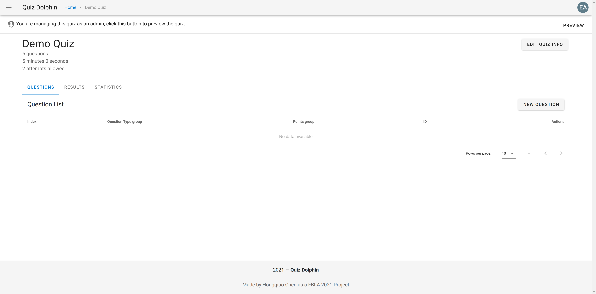
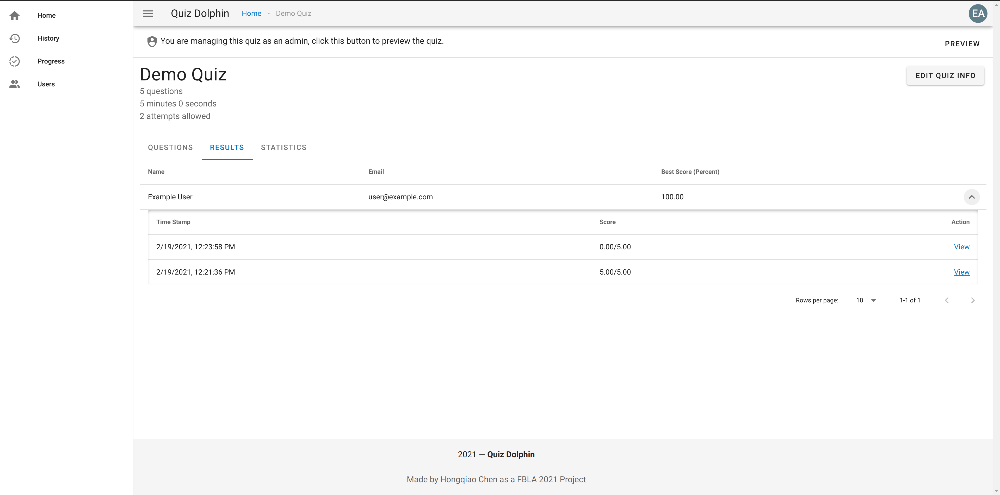

# Quiz Management

Please click *ACCESS QUIZ* and you will be presented with a quiz management console similar to this.

This management console allows you to do folowing tasks.

- Create, read, update, or delete a question.

- View quiz results and user submissions.

- Inspect the score distribution of the quiz.

- Update quiz information (same as information used to create a quiz).

We will talks about them in order.

## Managing Questions

The first tab, *QUESTIONS*, allows you to manage the questions of this quiz. Questions will show up once we add them to this quiz. Please click *NEW QUESTION* at the right hand side.

You will need to first select a question type and this question's points. We will use single choice as an example. 

For single choice questions, Quiz Dolphin allows you to specify the context of the question, options for student to choose from, and select an answer. Please select save to save the question. The following is details about each type of question.

- *Single choice* - Student chooses one option they believe is correct from some options, and only recieve points if that's a correct option.

- *Multiple choice* - Student chooses multiple options, and recieve partial points if they did not select some of the correct options. They will recieve 0 points if they selected any of the wrong option.

- *Matching* - Contains a left column and right column. You can click add row to add a new column. Students will be asked to match the left column with the right one. When adding this type of question, you can just fill out the right col in the correct order, and the order will be randomnized when giving to student.

- *Short Response* - Students type in the answer they believe is correct, trailling spaces are ignore but *Case Sensitive* when judging the answer.

- *Fill in the blanks* - Students select options from a series of blanks to form a sentence that they believe is correct. Blanks are represented as a `[?]` in the context. Please type a `[?]` and you will see *Blank 1* automatically shows up at the bottom.

Now you have created a question, it should show up on the question list.

You can delete and edit this question at any time you want, but please notice that if the quiz is running, modifications to the quiz *Will Not* affected attempts that started before modification.

## Viewing Results

The *RESULTS* tab contains user's submissions and results of this quiz. It's very flexible and can be used for different purposes. It should be empty for now, but once the data comes in, it should look like this.

Results are organized into each person, with their email, name, and best score showed. You can sort by score to use it as a ranklist or sort by name to use it as a gradebook. By clicking the expanding arrow at the right hand side, you see student's attempt history. By click the *View* button you can view the detail of each attempt.

Each question is labeled with user's response and the correct answer.

You can also download a PDF Report with information on each question.

## Viewing Statistics

The *STATISTICS* tab contains information about score distribution, it should look similar to this.

Each x-axis shows a grade mark, and the y-axis shows how many people's best attempt falls into this mark.

## Updating Quiz Info

You can click *EDIT QUIZ INFO* button to edit quiz info, the procedure and information required is similar to creating a quiz.

That's it, we've covered all important aspects about managing a quiz, please nagivate to [History View](History-View.md) for information on the history page.
