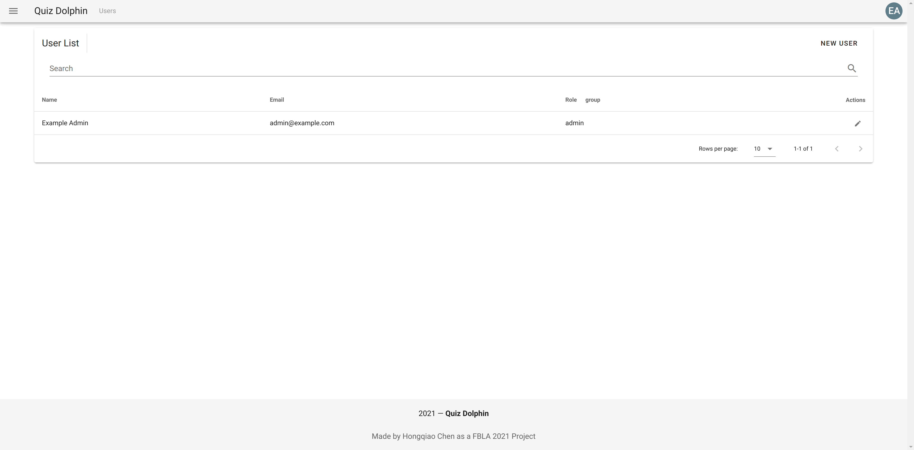
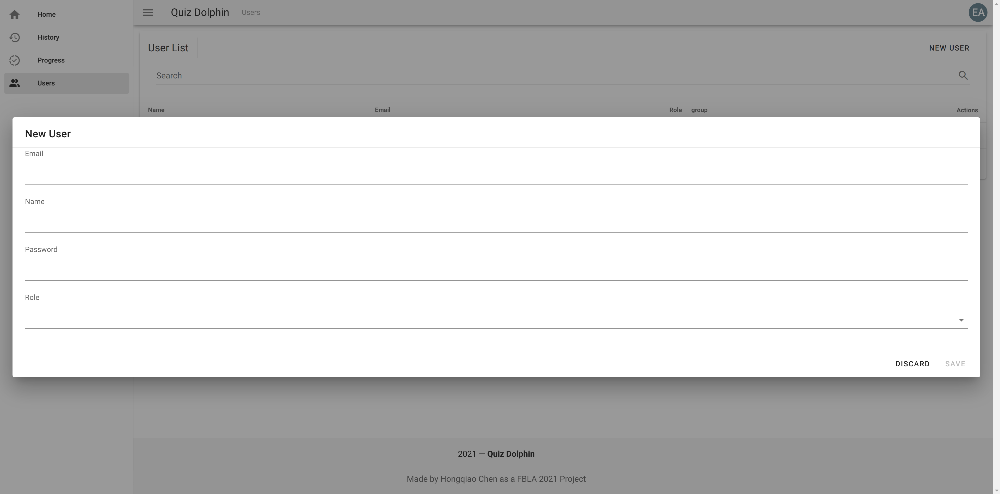
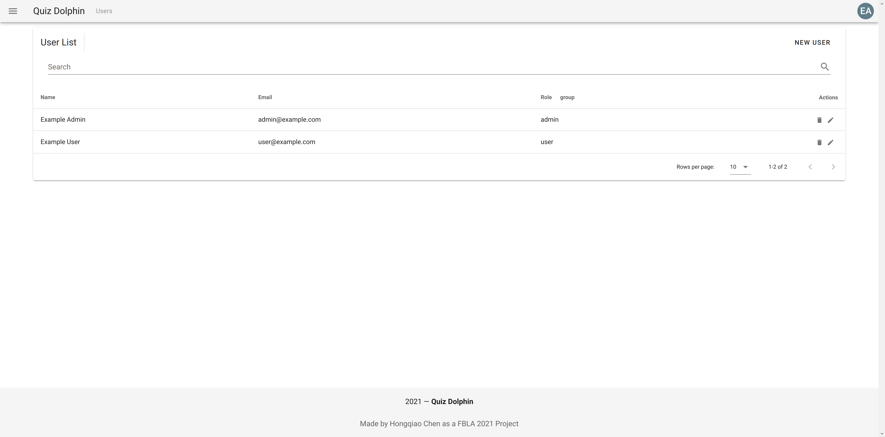

# User Management

Quiz Dolphin is a multi-user, multi-role system. User Management Console provides an entrypoint for admins to manage users in the system. You can create, view, edit, and delete users in this console.

Right now the only user in the system is the initial admin, but don't worry, we will create a new user soon. Please click *NEW USER* button.

## Creating a User

When creating a user, you can specify the Email, Name, Password and Role. Email and Name can not be changes once created. Admin user has access to all the records from all users in Quiz Dolphin, and has management functions such as add and delete quiz. User (regular) user has access to their own record and can take quiz. Please fill in these fields and click save. All fields are required for a new user.

## User List

After creating a new user, it should look similar to this.

In this view, you can search for a specific user or sort by name. You can also group users by their role. For each user, you can edit their information or delete a user. Please notice that you *Cannot* delete your self. Additionally, when editing a user, you need to specify a new password as the system does not record user's plain text password in the database. To be specific, only user's salt (a random number) and salted (hashed) password are stored in the database.

Congratulations! You completeted all modules of the admin's docs. You can also access user's docs if you would like to. [User's Docs - Getting Started](../user/Getting-Started.md)
