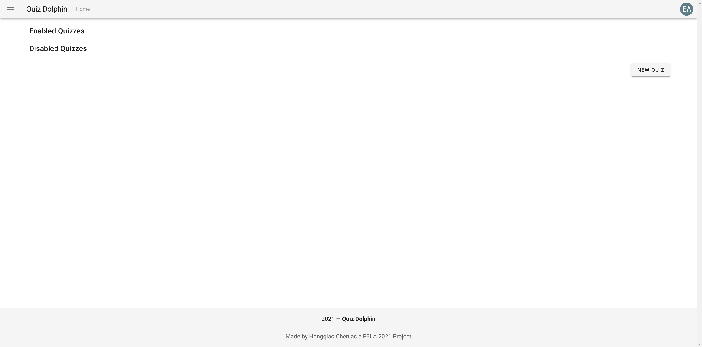
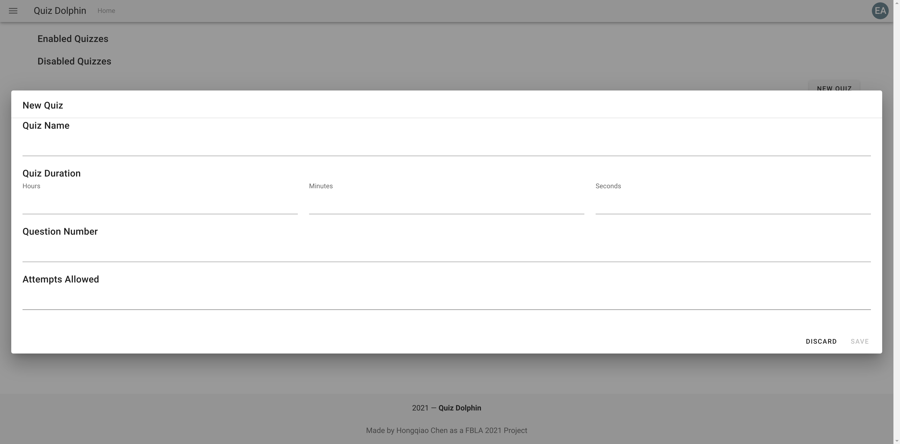
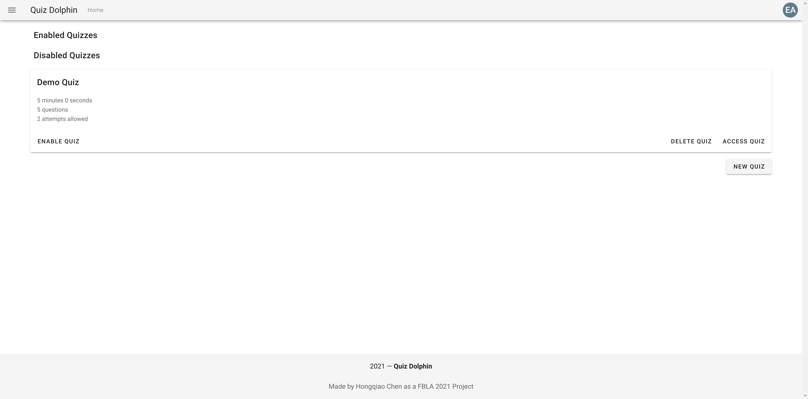
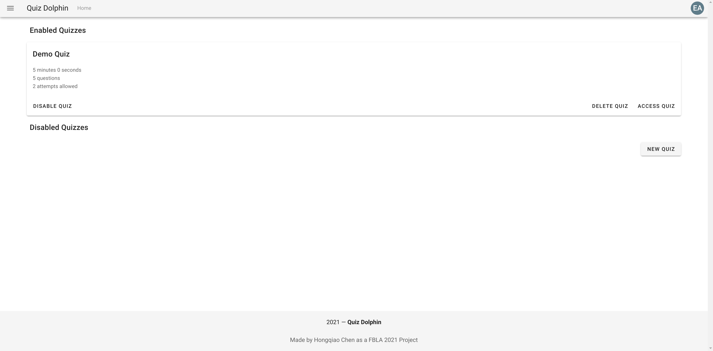

# Admin Homepage

The admin's homepage is divided into two sections, *Enabled Quizzes* and *Disabled Quizzes*.

*Enabled Quizzes* are quizzes that is currently accepting new submissions from user, while *Disabled Quizzes* are quizzes that is not accepting new submissions. Quizzes will show up once we add them to the system. Please click the *NEW QUIZ* button at the right hand side.

## Creating a Quiz

For every quiz, Quiz Dolphin allows you to specify the following specs.

- Quiz Name is the name that will show up on the quiz, please make this as unique as possible.

- Quiz Duration is how much time each attempt is allowed to take. Has to be at least 1 second.

- Question Number is how many questions will be showed for each attempt. Please notice if the number of avaliable questions in the quiz bank is not enough of fullfill the question number, less questions might be showed. Has to be at least 1.

- Attempts Allowed is how many attempts are allowed for each user on this quiz.

Please fill all the fields and click save. These information are needed to create a quiz. After creating the quiz, Quiz Dolphin will automatically navigate you to the newly-created quiz. A management view similar to this will be presented.

We will cover more information about managing quiz in the next section, now please go back to the quiz list.

## Quiz List

Newly created quiz is by default disabled. You can enable the quiz by clicke the *ENABLE QUIZ* button or delete it by clicking *DELETE QUIZ*. Please click enable to see its effect.

The quiz is automatically moved to the *Enabled Quizzes* section, you can disable it again if you want, but please notice that disabling a quiz only means no more new attempt can be started, unfinished attempts started before disabling can still be submitted until its own timer (duration) runs out. Now you can create, enable, disable, and delete quizzes, please navigate to [Quiz Management](Quiz-Management.md) for information on managing quiz.
