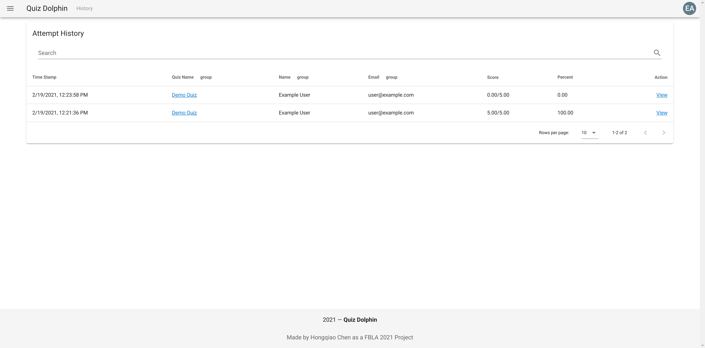

# History View

The history page is an entrypoint to all previously-happened attempts on Quiz Dolphin, from all quizzes and by all users. It's helpful when you want to find a specific attempt with some information such as email, date, point or ID.

All previous attempts are organized into a data table with each row showsing the Time Stamp, the Quiz Name (hyper-linked) associated with this attempt, the Name and Email of the person who accomplished this attempt, and the Score of this attempt. You can also view details by clicking *View* and you will be navigated to the review page of that attempt.

You can search with any information showed on the table, but please notice that when searching for a specific date, please use the `month/data/year, hour:minute:seconds` format. You can also sort the data by Time Stamp or group the data by Quiz, User Name, or Email.

That's it, we've covered all important information about the history page, please nagivate to [Progress View](Progress-View.md) for information on the progress page.
