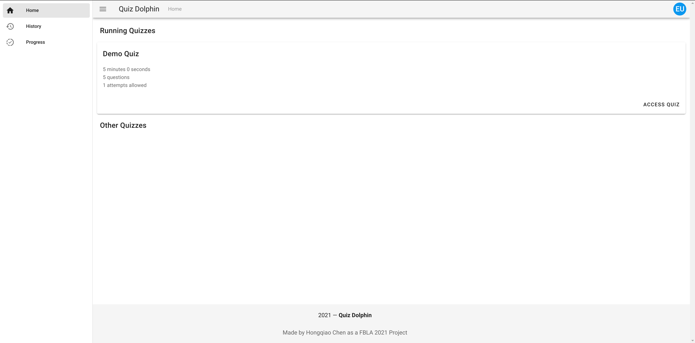

# Getting Started

Welcome to Quiz Dolphin! Please visit the domain your school or organization provided to access Quiz Dolphin, you should be presented with a window that looks like this.

Please enter the login credential your shcool or organization has provided. You have to login first before using this system.

This is the homepage of Quiz Dolphin. Before getting to know the quiz list, let's first take a look at the interface.

First, at the top-right corner, there's a user avatar. You can click on the avatar and it will shows your information and a logout button.

At the top-left corner, next to the hamburger menu and 'Quiz Dolphin' text, there's a top-bar breadcrumb navigation that shows where you are in the sytem. It's 'Home' for now but will change as you access different pages.'

At the top-left corner, there's a hamburger menu that helps you navigate through different pannels (refered to as 'Views' in the documentation), please click on that.

As you can see, there're totally 3 panels in the system. We will talk about them one by one. Now, please click this link to access docs on [Homepage](Homepage.md)  to learn more about navigating quizzes.
