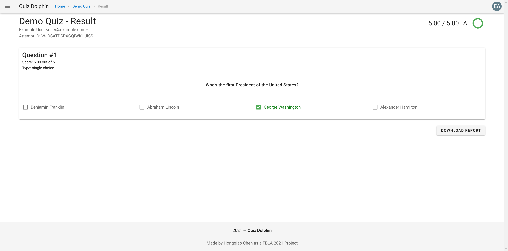
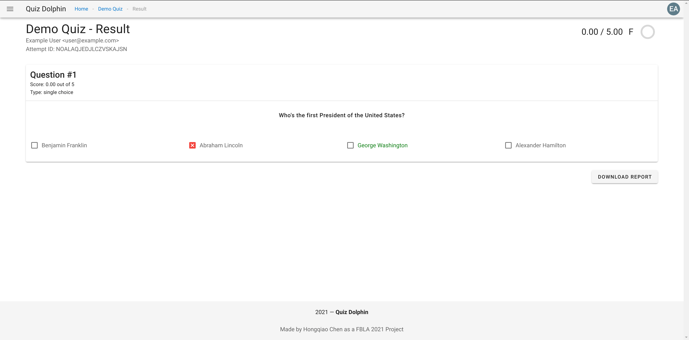
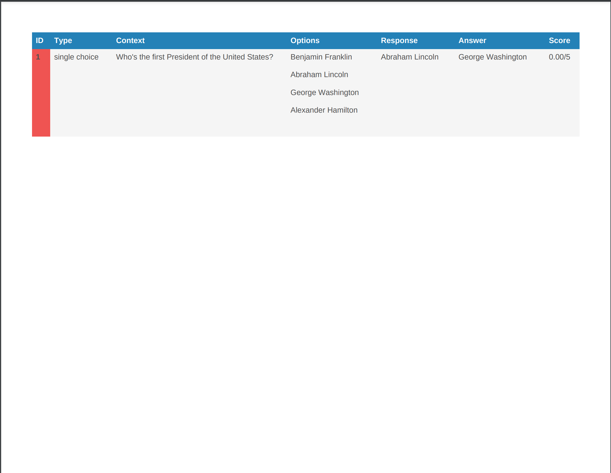

# Reviewing Quiz Result

When reviewing a quiz result, you can see your score and mark at the top right corner. Each individual is also labeled and you can see the correct answer. Text in green always means a correct answer.

You can also click the *DOWNLOAD REPORT* button to download a printable pdf report, which looks similar to this.

That's it about reviewing quiz result, please head to the next section [History Panel](History-View.md).
