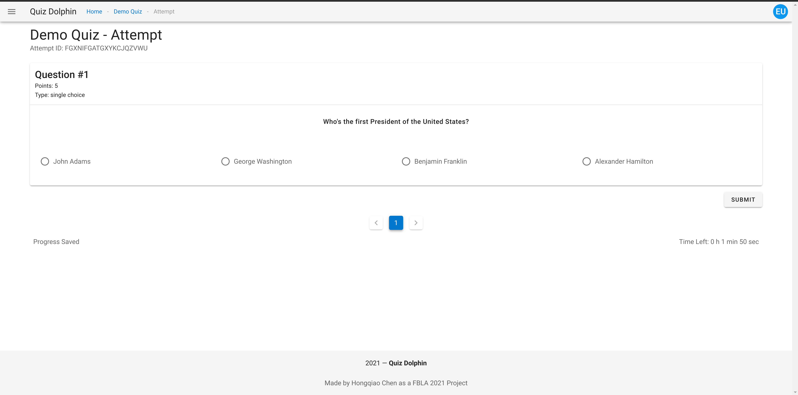
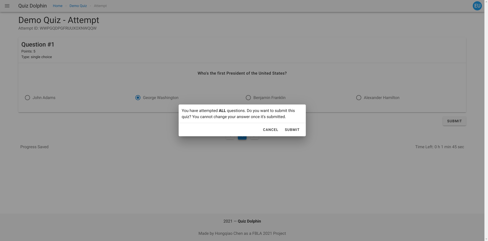

# Taking Quiz

When taking a quiz, each individual question will be showed as a card in the center of the interface, you can switch questions using the pagination bar or back/next button.

On the bottom left there will be a timer indicating how much time you have left. If the timer runs to 0 the quiz will be automatically submitted.

All progress are automatically saved to cloud as you make changes to your response. So you should never worry about lossing your quiz progress.

When you are done with the quiz, click the *SUBMIT* button (this button is only available when you are on the last question). The system will remind you how many questions you have attempted and skd for confirmation. Once your attempt is submitted, you can not change your response. Now, please click *SUBMIT*.

That's it, you just finished your first quiz with Quiz Dolphin! Please head to the next section [Review Result](Review-Result.md).
