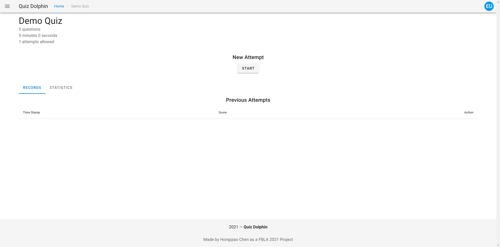

# Viewing Quiz

Please click *ACCESS QUIZ* button from homepage to access quiz, you should see something similar to this.

## Attempt Records

The first tab *RECORDS* shows all your previous attempts. Data is by default sorted by the time stamp of submission. You click the *View* link to see the detail of each attempt. For more information on the quiz review page, please refer to [Quiz Review Docs](Quiz-Review.md).

## Statistics

The second tab *STATISTICS* shows a line chart of your performance history on thiz quiz. You can hover over a data point to see the percentage.

## New Attempt

You can start a new attempt by click the *START* button under New Attempt section. If you have an ongoing progress, the button will say *CONTINUE* and allows you to continue your ongoing attempt. Please notice that most quiz has an attempt number limit.

That's it, now you know about accessing the quiz. Please click *START* to start a new attempt and navigate to [Taking Quiz](Taking-Quiz.md).
